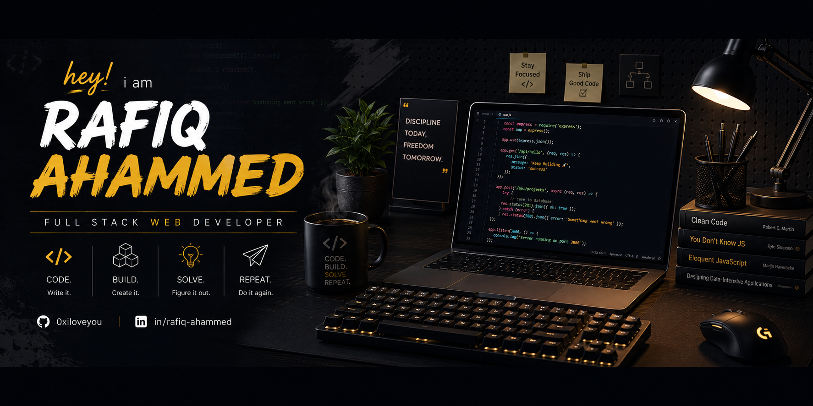

  

  

  
  
  

---

## About Me

I am a passionate developer who enjoys building clean, useful, and scalable web applications. I like turning ideas into real products with modern frontend tools, solid backend APIs, and practical database design.

- I am currently exploring **Next.js**, **TypeScript**, and modern full-stack development.
- I am working on web projects with **React**, **Node.js**, **Express.js**, and databases.
- I enjoy learning better ways to write maintainable code and improve user experience.
- I am open to collaboration on meaningful web development projects.

## Connect With Me

  
  
  

## Technology Stack

### Languages

  

### CSS Frameworks

  

### JavaScript Frameworks & Libraries

  

### Database & ORM

  

### Deployment Platforms

  
  

### Tools & Technologies

  

## GitHub Statistics & Analysis

  
  

  

  

  

